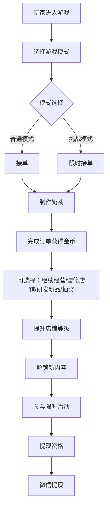

# 茉莉花奶茶店经营游戏设计文档

## 游戏概述

### 基本信息
- **游戏名称**：茉莉花奶茶店
- **游戏类型**：模拟经营 + 时间管理（混合模式）
- **目标平台**：iOS、Android
- **开发引擎**：Cocos Creator
- **目标用户**：全年龄段玩家
- **美术风格**：卡通可爱风格

### 核心概念
这是一款以茉莉花为主题的经营模拟游戏，玩家将经营一家特色奶茶店，通过接单、制作、装修店铺、研发新品等方式提升店铺等级，同时参与限时活动获得额外奖励。游戏结合了轻松的日常经营和刺激的挑战模式，适合不同偏好的玩家。

## 游戏特色

### 1. 混合模式玩法
- **普通模式**：轻松经营，无时间压力，享受开店乐趣
- **挑战模式**：限时接单，考验反应速度和策略
- **双倍收益活动**：特定时间段内完成任务获得双倍金币

### 2. 丰富的经营元素
- **订单系统**：不同难度的订单，对应不同报酬
- **制作系统**：简单直观的制作流程
- **升级系统**：店铺等级提升解锁新内容
- **装修系统**：个性化装饰店铺
- **研发系统**：解锁新品和特殊配方

### 3. 多样化的奖励机制
- **虚拟货币系统**：金币作为主要游戏内货币
- **阶段性奖励**：达成目标获得丰厚奖励
- **抽奖机制**：多种抽奖活动，获得稀有道具
- **成就系统**：收集徽章，展示成就

## 详细设计

### 游戏系统架构

#### 1. 核心游戏循环

#### 2. 订单系统

**订单类型**：
- **基础订单**：简单奶茶制作（茉莉奶茶、珍珠奶茶等）
- **进阶订单**：复杂配方（芝士奶盖、多系列混合）
- **特殊订单**：限时活动专属订单

**订单难度**：
- **简单**：2-3个步骤，30秒完成
- **中等**：3-4个步骤，45秒完成
- **困难**：4-5个步骤，60秒完成

**订单奖励**：
- 简单订单：10-50金币
- 中等订单：50-100金币
- 困难订单：100-200金币

#### 3. 制作系统

**制作流程**：
1. 选择订单
2. 准备材料（拖拽或点击）
3. 按顺序添加配料
4. 完成制作

**材料系统**：
- **基础材料**：茶叶、牛奶、糖、冰块
- **特色材料**：茉莉花瓣、珍珠、椰果、布丁
- **特殊材料**：限量版配料、活动专属材料

#### 4. 升级系统

**店铺等级**：
- 每升一级需要：当前等级×1000金币
- 升级后效果：
  - 解锁新品配方
  - 增加订单上限
  - 提升单次收益
  - 解锁新的装饰选项

#### 5. 装修系统

**装饰分类**：
- **墙面**：不同风格的壁纸
- **地板**：各种材质和图案
- **桌椅**：舒适度和美观度兼顾
- **装饰品**：壁画、植物、灯具
- **收银台**：升级后提升服务效率

**装饰效果**：
- 提升顾客满意度
- 增加订单概率
- 提升制作效率
- 增加游戏乐趣

#### 6. 研发系统

**研发内容**：
- **新品奶茶**：茉莉系列、果茶系列、奶盖系列
- **特殊配方**：限量版、季节限定
- **制作工具**：自动搅拌机、快速冷藏设备

**研发条件**：
- 达到指定等级
- 消研发材料
- 消耗金币

### 奖励机制设计

#### 1. 虚拟货币系统
- **金币**：主要游戏内货币
  - 获得方式：完成订单、活动奖励、每日签到
  - 用途：购买材料、装修店铺、研发新品、抽奖
- **钻石**：高级货币
  - 获得方式：充值、成就奖励、特殊活动
  - 用途：加速升级、购买特殊道具、兑换稀有物品

#### 2. 阶段性奖励
- **等级奖励**：每5级获得一次大奖励
  - 5级：100金币 + 5钻石
  - 10级：500金币 + 20钻石 + 装饰品
  - 15级：1000金币 + 50钻石 + 新品配方
  - 20级：2000金币 + 100钻石 + 限量皮肤

#### 3. 抽奖机制
- **免费抽奖**：
  - 每日1次
  - 奖励：金币、小道具
- **付费抽奖**：
  - 使用钻石抽奖
  - 奖励：稀有材料、限量装饰、特殊配方
- **活动抽奖**：
  - 限时活动开启
  - 奖励：大奖品、现金红包资格

### 微信提现系统

#### 1. 提现资格
- **基础资格**：达到10级
- **每日提现**：完成当日100订单
- **周末双倍**：周末完成任务可获得双倍提现额度

#### 2. 提现规则
- **最低提现**：10元起
- **提现方式**：微信红包
- **提现时间**：24小时内到账
- **每日限额**：100元/人
- **每月限额**：1000元/人

#### 3. 提现奖励
- **基础收益**：100订单 = 10元
- **等级加成**：每10级增加2元收益
- **活动加成**：活动期间收益翻倍
- **会员加成**：VIP会员额外增加10%收益

#### 4. 防作弊机制
- **订单验证**：确保订单真实完成
- **行为分析**：监测异常游戏行为
- **设备限制**：单设备单账号
- **实名认证**：提现前需完成实名

### 会员系统

#### 1. 会员等级
- **普通会员**：基础功能
- **白银会员**：充值6元/月
- **黄金会员**：充值30元/月
- **钻石会员**：充值68元/月

#### 2. 会员特权
- **收益加成**：会员订单额外获得10%-30%金币
- **特权道具**：每日免费道具次数增加
- **专属装饰**：会员专属装饰和皮肤
- **提现加成**：提现金额额外增加10%
- **优先客服**：VIP专属客服通道

### 活动系统

#### 1. 日常活动
- **每日签到**：连续签到获得奖励
- **订单挑战**：完成指定数量订单
- **装修大赛**：装饰度评比活动

#### 2. 限时活动
- **双倍收益**：周末限定2小时
- **新品发布**：新配方限时优惠
- **节日活动**：节日专属任务和奖励
- **排行榜竞赛**：全服排行榜争夺

#### 3. 社交活动
- **好友助力**：好友帮助加速制作
- **礼物赠送**：赠送装饰品给好友
- **店铺参观**：互访好友店铺点赞

## 界面设计

### 1. 主界面
- **店铺全景**：显示装修后的奶茶店
- **订单板**：显示当前订单
- **功能按钮**：制作、装修、研发、背包
- **玩家信息**：等级、金币、钻石

### 2. 制作界面
- **制作区域**：显示制作台
- **材料区**：各种材料选项
- **订单信息**：显示订单详情和倒计时
- **完成按钮**：提交成品

### 3. 装修界面
- **2D店铺平面图**
- **装饰分类菜单**
- **预览功能**：实时查看效果
- **保存功能**：应用装修

### 4. 活动界面
- **活动列表**
- **活动详情**
- **参与按钮**
- **奖励预览**

## 技术实现

### 1. Cocos Creator架构
- **场景管理**：主场景、制作场景、装修场景
- **UI系统**：基于Widget的响应式UI
- **动画系统**：缓动动画和序列动画
- **音频系统**：背景音乐和音效

### 2. 数据存储
- **本地存储**：玩家进度、装饰配置
- **云端同步**：账号数据、活动数据
- **加密处理**：敏感数据加密存储

### 3. 网络功能
- **登录系统**：微信一键登录
- **数据同步**：云端存档
- **活动同步**：实时活动更新
- **排行榜**：全服数据

## 商业模式

### 1. 免费内容
- 基础游戏玩法
- 常规订单和奖励
- 基础装修选项
- 每日免费抽奖

### 2. 付费内容
- **月卡**：6元/月，提供收益加成
- **季卡**：30元/季，更多特权
- **年卡**：68元/年，顶级特权
- **道具购买**：钻石购买加速道具

### 3. 广告形式
- **激励广告**：观看广告获得奖励
- **插屏广告**：升级时弹出
- **Banner广告**：界面底部横幅

## 运营计划

### 1. 上线阶段
- **测试期**：1个月，收集反馈
- **公测期**：2个月，数据收集
- **正式运营**：持续更新

### 2. 内容更新
- **每周更新**：小型活动和装饰
- **每月更新**：新品和重大活动
- **季度更新**：大型版本更新

### 3. 用户运营
- **社群运营**：建立玩家社群
- **反馈收集**：定期收集建议
- **节日运营**：节日特别活动

## 风险评估

### 1. 技术风险
- **性能优化**：确保流畅运行
- **兼容性**：适配不同设备
- **稳定性**：服务器稳定性保障

### 2. 合规风险
- **提现规范**：符合微信提现规则
- **防作弊**：严格执行反作弊机制
- **内容审核**：确保内容合规

### 3. 商业风险
- **玩家留存**：持续吸引玩家
- **付费转化**：平衡免费和付费内容
- **竞争压力**：差异化竞争策略

## 总结

茉莉花奶茶店经营游戏通过混合模式玩法、丰富的经营元素和多样的奖励机制，为全年龄段玩家提供了一个轻松有趣的游戏体验。游戏注重玩家的长期参与感，通过装修、研发、活动等多种内容保持玩家兴趣。同时，合理的提现机制和会员系统为游戏的商业运营提供了保障。

本设计文档涵盖了游戏的各个核心系统，为后续的开发实施提供了详细的指导。在实际开发过程中，可以根据实际情况和技术要求进行适当调整和优化。

---

### 版本信息
- **文档版本**：v1.0
- **创建日期**：2026年4月27日
- **最后更新**：2026年4月27日
- **后续计划**：基于此文档进行技术实现规划和开发